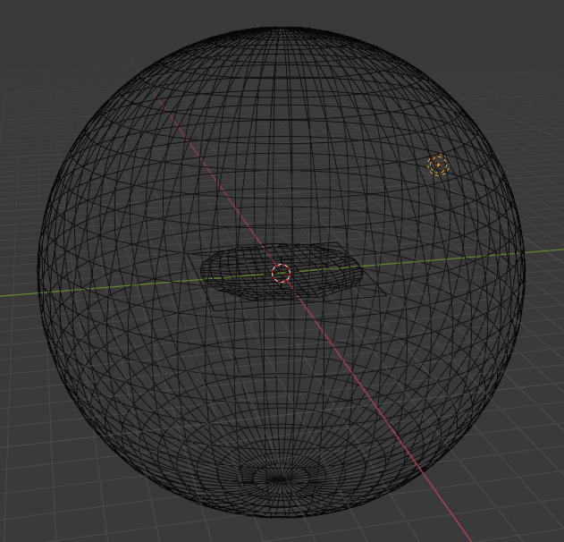
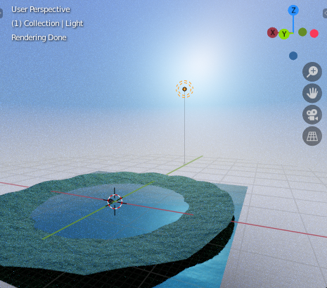
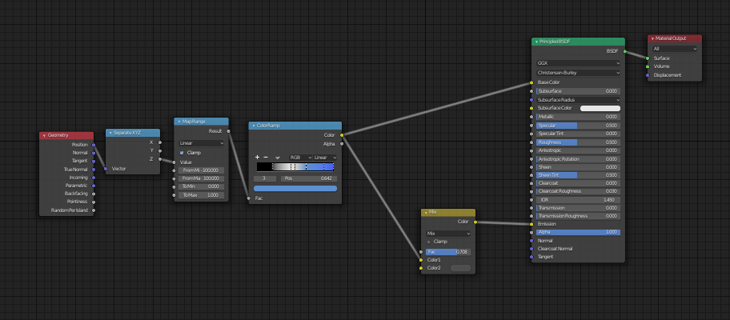
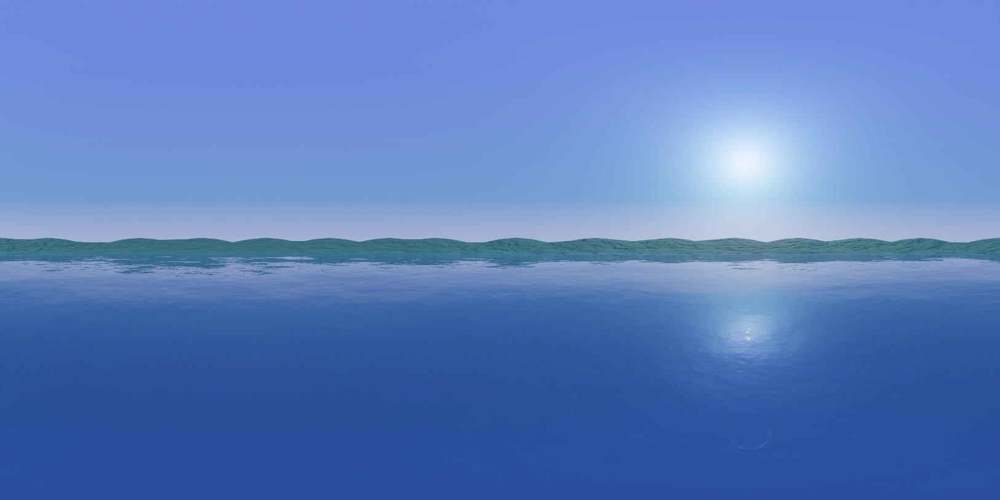
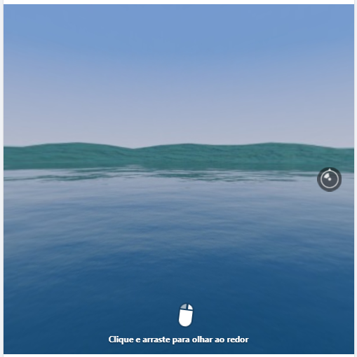

# blender_hdri_template

A basic Blender file to be used as example / starting point for HDRI rendering.

The following setup must be kept unchanged when using this file for your own HDRI maps:

- `Render Properties -> Render Engine` must be set to `Cycles`
- `Output properties -> Dimensions -> Resolution` must have a `2:1` proportion (width always exactly double the height)
- `Output properties -> Output -> File Format` must be either `Radiance HDR` for HDRI maps, or `OpenEXR` for spherical panorama scenes (those 360&deg; pictures you can move around with your mouse, e.g. https://www.360cities.net/ ) - except facebook (check below for specific details)
- `Camera -> Lens -> Type` must be set to `Panoramic`
- `Camera -> Lens -> Panorama Type` must be set to `Equirectangular`
- `Camera -> Location` set to `(0, 0, 0)` and `Camera -> Rotation` set to `(90, 0, -90)` for orientation consistency with the common practice on HDRI maps

Also, use of `View Layer Properties -> Denoising` is strongly recommended.

### Scene structure

The scene contains a sphere object with all normals facing inside, used to draw the sky colour. There is a single light object illuminating the scene, which is intentionally close to the sphere surface in order to make the sky brighter in the direction the light comes from. 

Due to this, the sky is made using a combination of diffuse and emission (a pure emission sky would not be affected by the light). The world vertical position for each point in the sphere is applied to a ColorRamp, and the resulting colour is directly used as diffuse ("base color"). The same output is mixed with a darker tone before being applied to emission. Mixing this tone too hard (reducing the emission) causes the sky far from the light to be too dark, while using too low a factor (increasing emission) causes the sky colour to be too strong (as the tone is used as both emission and diffuse at the same time).

An example scene with a lake and mountains is already provided, as the "Ground" and "Water" objects. To start your own scene, remove those (but not the rest). 

You are free to change the lights but keep in mind the trick to increase the sphere brightness in the counter-direction.

### Usage

To generate the HDRI map, hit `F12`, and after rendering select `Image -> Save As...` and save with the `.hdr` extension for `Radiance HDR` or `.exr` for `OpenEXR`.

The output result of this scene is provided as `output_example.hdr`

### Facebook spherical images

Interactive spheric panoramas in facebook will only work with *JPG* files with EXIF metadata. In order to achieve this:

- `Output properties -> Output -> File Format` must be `JPG`
- Render the image normally and save as `.jpg`
- After rendering, use `exiftool` (link below) to inject the correct metadata in the saved file, using the following command line: `exiftool -ProjectionType="equirectangular" <filename>.jpg`
- Upload the image to facebook using the web version (not the app)

`exiftool` is found at https://exiftool.org/

